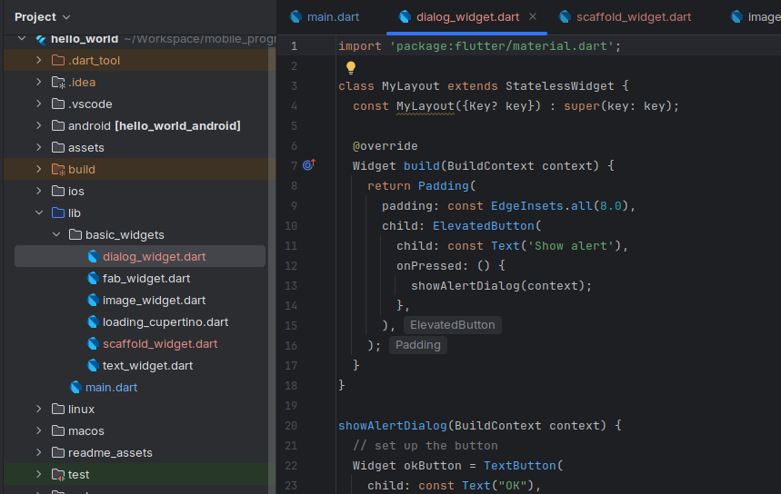

# hello_world

A new Flutter project.

## Getting Started

### Praktikum 1: Membuat Project Flutter Baru
Saya membuat project baru di Android Studio.

### Praktikum 2: Menghubungkan Perangkat Android atau Emulator
Saya menggunakan perangkat fisik android untuk menjalankan project flutter saya. Saya tinggal melakukan koneksi ke wifi yang saya dengan device fisik saya, lalu melakukan beberapa perintah berikut untuk mengkoneksikan ke perangkan fisik saya,

### Praktikum 3: Membuat Repository GitHub dan Laporan Praktikum
Setelah itu melakukan push project ke github, dan saya sudah melakukannya seperti berikut,

### Praktikum 4: Menerapkan Widget Dasar
#### Text Widget
Saya sudah menambahkan widget baru untuk menampilkan Text sesuai dengan keinginan saya,

#### Image Widget
Lalu untuk image widget saya juga sudah melakukan:
- meletakkan logo polinema di assets
- mengubah pubspect.yaml untuk image path logo dari assets
- menampilkan di layar dengan widget image

### Praktikum 5
#### Scaffold Widget
Disini saya membuat file baru bernama `scaffold_widget.dart`,

Lalu tampilannya seperti berikut,

#### Dialog Widget
Disini saya membuat file baru bernama `dialog_widget.dart`,

Lalu tampilannya seperti berikut,

#### Input dan Selection Widget
Disini saya membuat file baru bernama `input_widget.dart`,

Lalu tampilannya seperti berikut,

#### Date and Time Pickers
Disini saya membuat file baru bernama `date_and_time_widget.dart`,

Lalu tampilannya seperti berikut,
