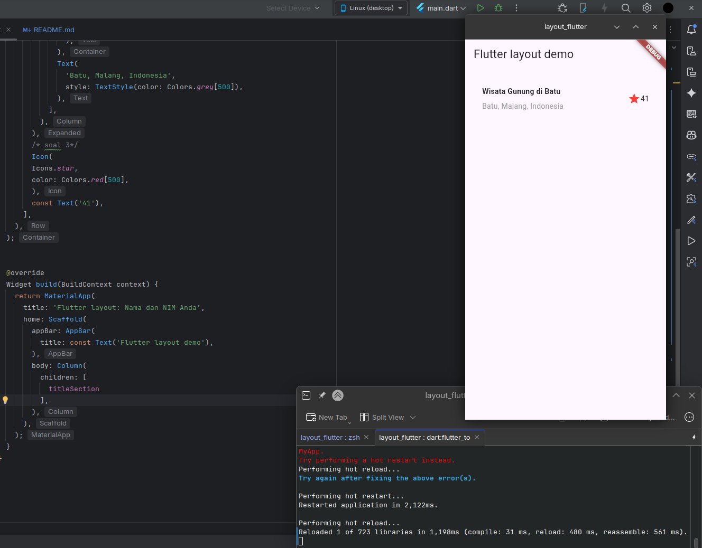
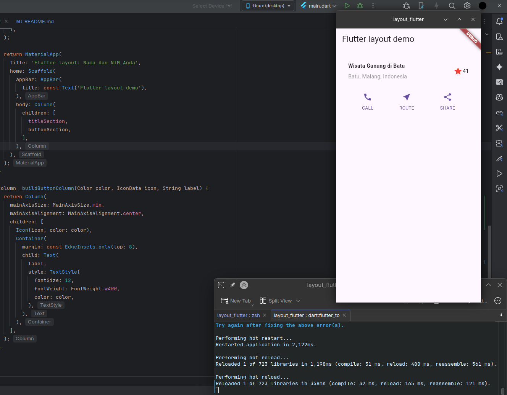
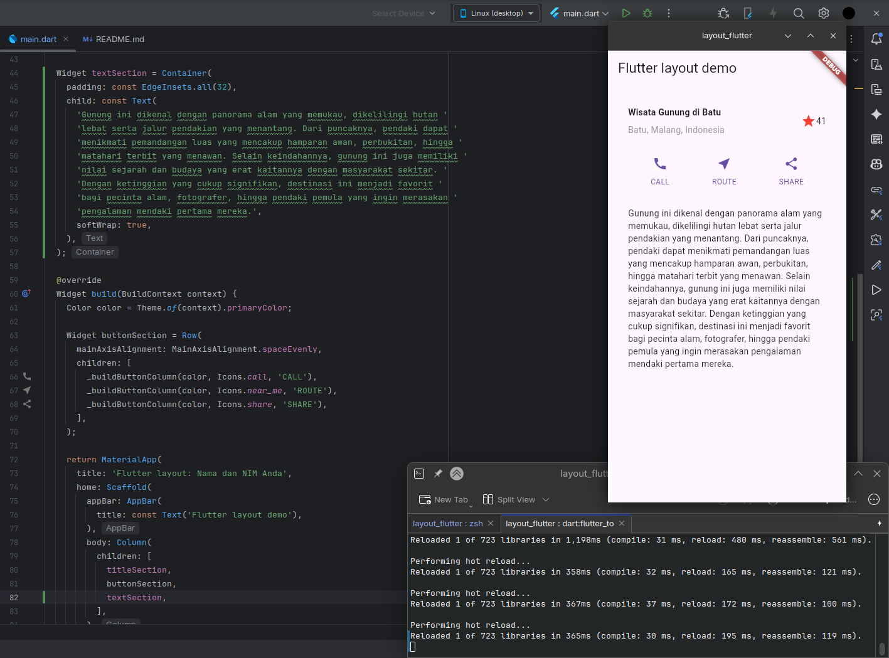
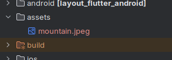
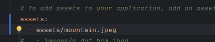
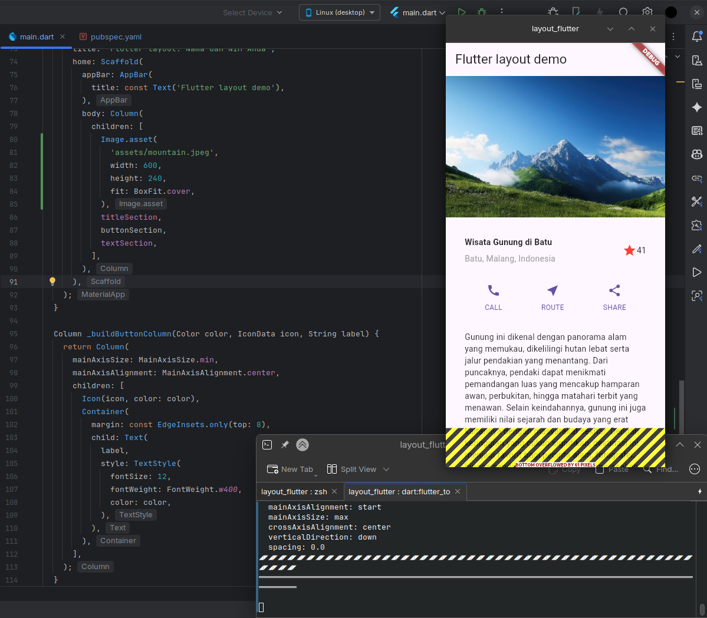
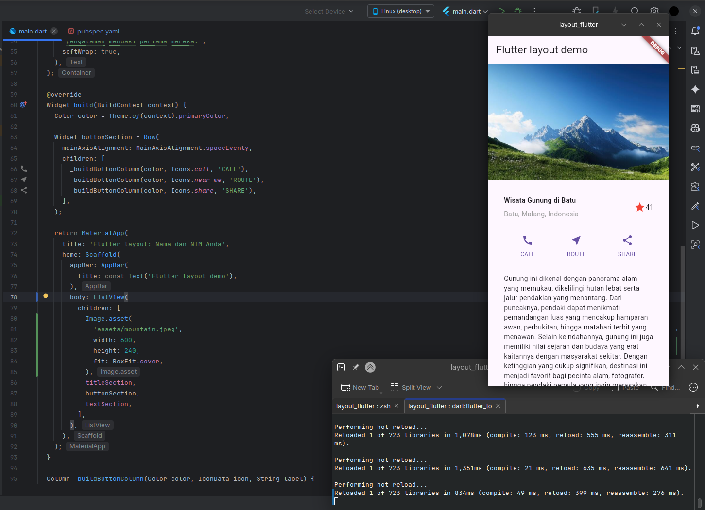

# layout_flutter

A new Flutter project.

## Getting Started - Tugas Praktikum 1

### Praktikum 1: Membangun Layout di Flutter
Saya membuat project layout_flutter baru, melakukan styling beberapa widget dan tampilan dan hasilnya adalah seperti berikut,

### Praktikum 2: Implementasi button row
Setelah itu saya menambahkan styling widget baru untuk menampilkan baris tombol CALL, ROUTE, dan SHARE seperti berikut,

### Praktikum 3: Implementasi text section
Saya melakukan styling widget baru dengan menambahkan text description section dari halamannya seperti berikut,

### Praktikum 4: Implementasi image section
Saya membuat folder assets di root project saya lalu menyimpan image mountain.jpeg seperti berikut,

Tak lupa juga untuk menambahkan path nya di pubspec.yaml

Setelah itu saya melakukan styling widget lagi untuk menambahkan widget image preview di layar, dan hasilnya akan menjadi seperti berikut,

Terlihat jika widget saya terjadi overflow, itu terjadi karena memang saya menggunakan `Column()` untuk styling dan menyusun widget secara vertikal dan sebagain konten dari widget tertutup dan tidak dapat terlihat oleh pengguna. 

Maka penyelesaiannya cukup mudah, kita tambahkan `ListView()` agar layar dapat discroll, sehingga konten widget yang tertutup bisa ditampilkan/tidak tertindih, dan hasilnya seperti berikut,

## Getting Started - Tugas Praktikum 2

### Praktikum 5: Membangun Navigasi di Flutter