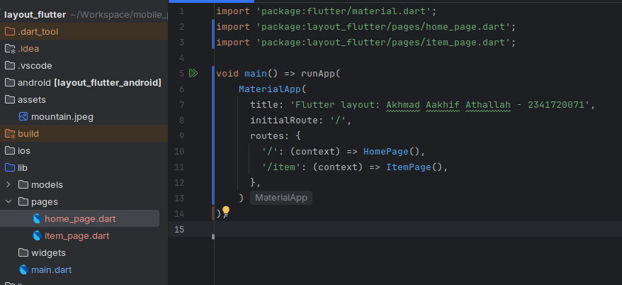
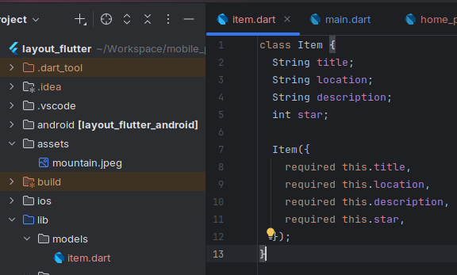
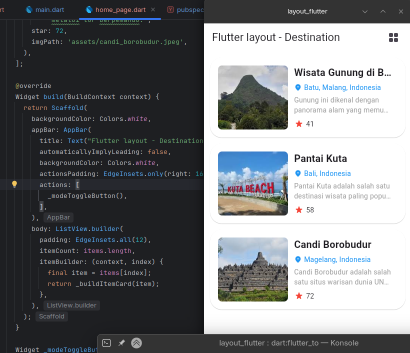
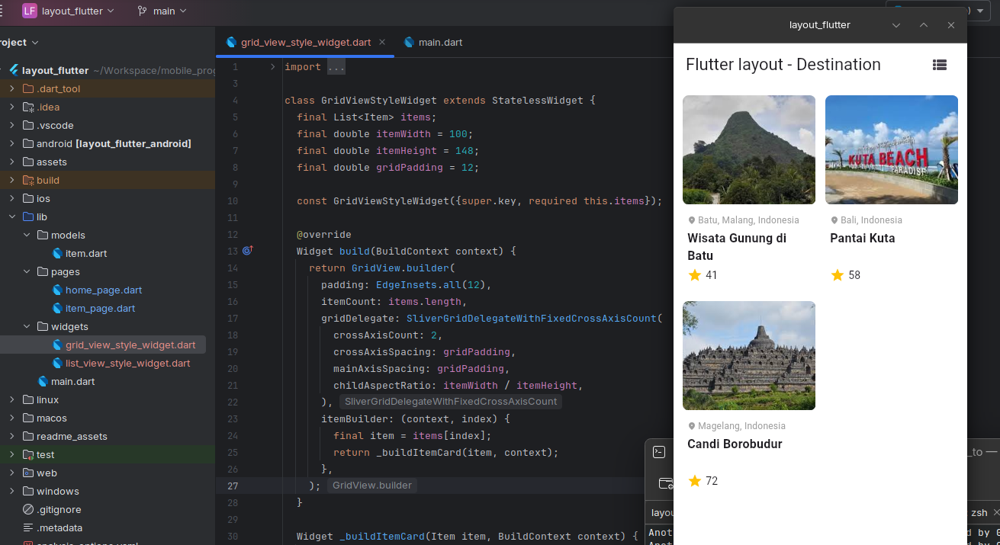
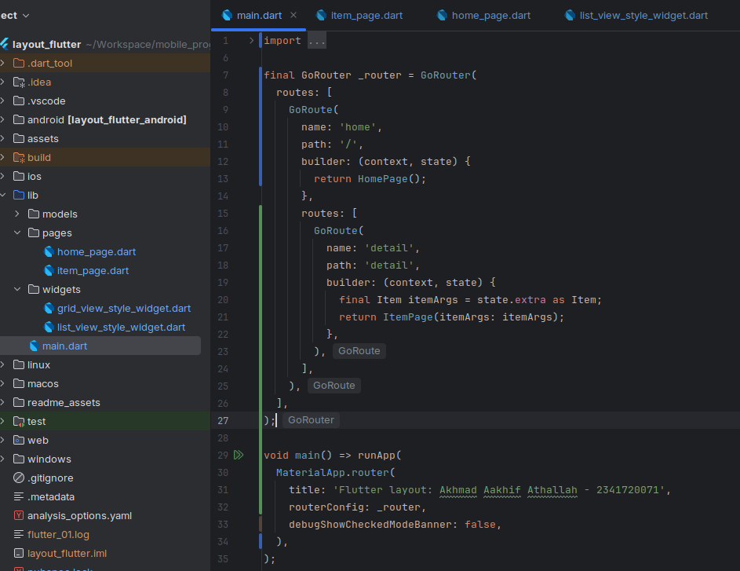
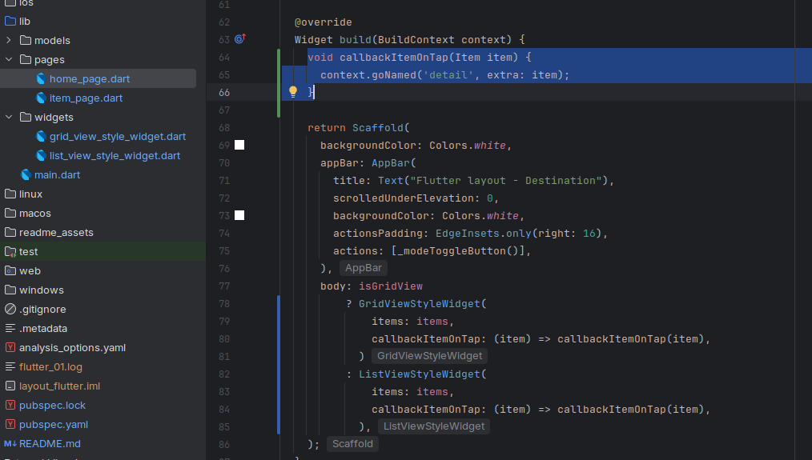

# layout_flutter

A new Flutter project.

## Getting Started - Tugas Praktikum 1

### Praktikum 1: Membangun Layout di Flutter
Saya membuat project layout_flutter baru, melakukan styling beberapa widget dan tampilan dan hasilnya adalah seperti berikut,

### Praktikum 2: Implementasi button row
Setelah itu saya menambahkan styling widget baru untuk menampilkan baris tombol CALL, ROUTE, dan SHARE seperti berikut,

### Praktikum 3: Implementasi text section
Saya melakukan styling widget baru dengan menambahkan text description section dari halamannya seperti berikut,

### Praktikum 4: Implementasi image section
Saya membuat folder assets di root project saya lalu menyimpan image mountain.jpeg seperti berikut,

Tak lupa juga untuk menambahkan path nya di pubspec.yaml

Setelah itu saya melakukan styling widget lagi untuk menambahkan widget image preview di layar, dan hasilnya akan menjadi seperti berikut,

Terlihat jika widget saya terjadi overflow, itu terjadi karena memang saya menggunakan `Column()` untuk styling dan menyusun widget secara vertikal dan sebagain konten dari widget tertutup dan tidak dapat terlihat oleh pengguna. 

Maka penyelesaiannya cukup mudah, kita ubah `Column()` menjadi `ListView()` agar layar dapat discroll, sehingga konten widget yang tertutup bisa ditampilkan/tidak tertindih, dan hasilnya seperti berikut,

## Getting Started - Tugas Praktikum 2

### Praktikum 5: Membangun Navigasi di Flutter
> [!WARNING]
> Disini saya **tidak** membuat project baru bernama "belanja", tetapi saya akan melanjutkan project yang sebelumnya telah dibuat, yaitu project "layout_flutter".

Jadi saya akan melakukan beberapa hal di project ini, diantaranya:
- **pembuatan routing** dengan menggunakan `navigator`
- **pembuatan listview** di halaman home terlebih dahulu
- dilanjutkan dengan **pembuatan gridview** di halaman home (menggantikan listview yang telah dibuat)
- **menerapkan Hero()** widget

Pertama tama saya akan membuat route terlebih dahulu untuk masing masing halaman (`home_page.dart` dan `item_page.dart`) seperti berikut,

Lalu saya akan membuat model/object dari item yang saya miliki seperti berikut,

Setelah itu saya membuat tampilan list menggunakan `ListView.builder()`

Setelah itu saya menambahkan tampilan grid kedalam aplikasi saya, menjadi seperti berikut,

Setelah itu saya juga selesai untuk menambahkan `Hero widget`, untuk hasil akhirnya adalah seperti berikut,

Lalu saya juga mengubah konfigurasi routing menjadi menggunakan GoRouter (paket flutter resmi dari pub.dev), dan berikut adalah cuplikan kodenya,

Dan berikut adalah pada saat go router dipanggil untuk menampilkan halaman baru,

