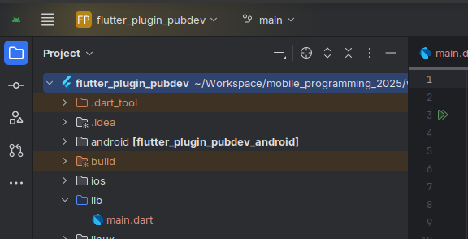
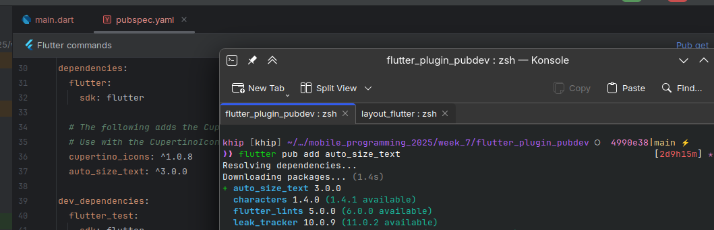
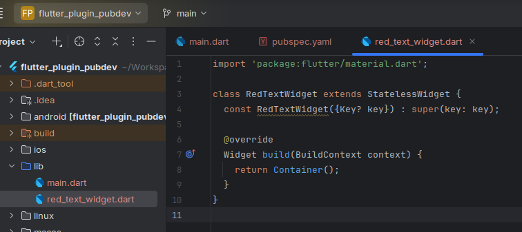
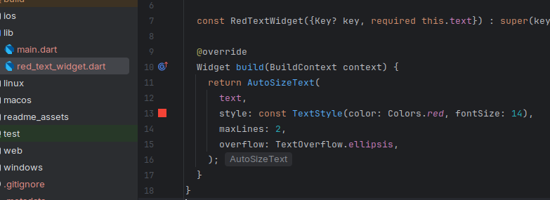
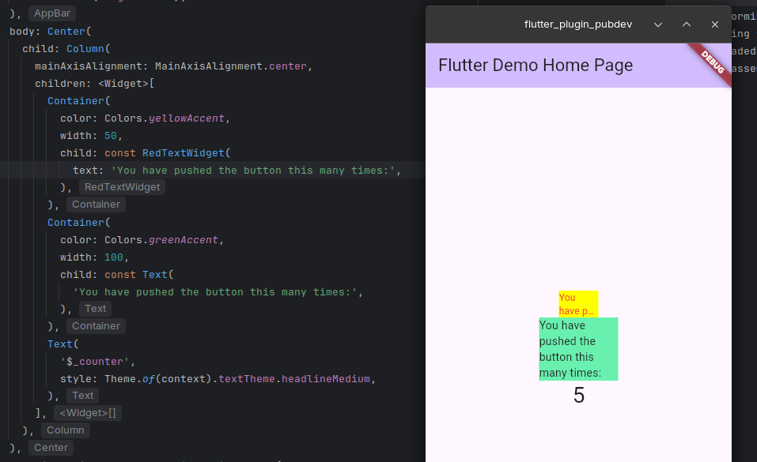

# flutter_plugin_pubdev

A new Flutter project.

## Praktikum

Saya membuat project flutter baru bernama `flutter_plugin_pubdev`. 

Setelah itu saya menambahkan plugin baru bernama `auto_size_text`.  

Lalu saya membuat file `red_text_widget.dart`

Setelah itu saya menambahkan widget AutoSizeText hasil penambahan plugin flutter `auto_size_text` yang telah dilakukan tadi,

Dan saya juga tak lupa untuk menambahkan parameter di konstruktor di class RedTextWidget().

Setelah itu saya memanggil widget yang telah dibuat (RedTextWidget()) di dalam column dari file `main.dart`, dan hasilnya adalah sepertti berikut,

 

## Tugas Praktikum
2. **Jelaskan maksud dari langkah 2 pada praktikum tersebut!**

Langkah itu bertujuan untuk menambahkan paket/dependensi baru bernama `auto_size_text` dari repositori resmi flutter ke dalam project kita, menggunakan perintah di konsole.

3. **Jelaskan maksud dari langkah 5 pada praktikum tersebut!**

Untuk membuat sebuah widget yang dapat digunakan berkali-kali, kita bisa meminta value secara dinamis dari luar widget custom yang telah kita buat dengan menggunakan konstruktor. 

Pada kasus ini dicontohkan dengan menggunakan `String text`, sehingga pada saat custom widget dipanggil, kita bisa mengatur isi `text` yang kita mau.

4. **Pada langkah 6 terdapat dua widget yang ditambahkan, jelaskan fungsi  dan perbedaannya!**

Fungsi dari penambahan 2 widget tersebut adalah untuk membandingkan widget `Text` dengan custom widget `RedTextWidget` yang telah kita buat sebelumnya. Yang dimana kita harus memanggil nama custom widget  nya, setelah itu kita mengisikan parameter yang diperlukan.

Perbedaannya ada pada hasil yang ditampilkan, widget `Text` biasa hanya menampilkan text dengan ukuran dan warna default/bawaan flutter, sedangkan widget `RedTextWidget` menampilkan hasil styling custom widget yang telah kita buat sebelumnya. 

5. **Jelaskan maksud dari tiap parameter yang ada di dalam plugin auto_size_text berdasarkan tautan pada dokumentasi ini !**

# 📘 Parameter `AutoSizeText` (Flutter)

| **Parameter** | **Penjelasan** |
|----------------|----------------|
| **key*** | Digunakan untuk membedakan satu widget dengan widget lainnya di dalam *widget tree*. |
| **textKey** | Memberikan `key` khusus untuk widget `Text` yang dibuat oleh `AutoSizeText`. |
| **style*** | Mengatur gaya teks seperti ukuran font, warna, dan jenis huruf yang digunakan. |
| **minFontSize** | Menentukan ukuran font minimum agar teks tetap terbaca saat menyesuaikan ukuran. |
| **maxFontSize** | Menentukan ukuran font maksimum yang boleh digunakan saat penyesuaian ukuran teks. |
| **stepGranularity** | Mengatur seberapa besar langkah perubahan ukuran font ketika menyesuaikan teks. |
| **presetFontSizes** | Daftar ukuran font yang sudah ditentukan sebelumnya (harus dalam urutan menurun). |
| **group** | Menyinkronkan ukuran teks dari beberapa `AutoSizeText` agar semua memiliki ukuran font yang sama. |
| **textAlign*** | Menentukan perataan teks, seperti `left`, `right`, `center`, atau `justify`. |
| **textDirection*** | Menentukan arah penulisan teks, misalnya dari kiri ke kanan (*LTR*) atau kanan ke kiri (*RTL*). |
| **locale*** | Menentukan lokal atau bahasa yang memengaruhi tampilan karakter sesuai gaya penulisan. |
| **softWrap*** | Mengatur apakah teks boleh berpindah ke baris baru ketika mencapai batas lebar. |
| **wrapWords** | Menentukan apakah kata yang tidak muat di satu baris akan dilanjutkan ke baris berikutnya. |
| **overflow*** | Mengatur bagaimana teks yang meluap ditampilkan, misalnya dipotong atau diberi tanda elipsis (...). |
| **overflowReplacement** | Widget pengganti yang akan ditampilkan jika teks tidak muat di area yang tersedia. |
| **textScaleFactor*** | Mengatur skala teks secara keseluruhan, yang juga memengaruhi `minFontSize`, `maxFontSize`, dan `presetFontSizes`. |
| **maxLines** | Menentukan jumlah maksimum baris teks yang dapat ditampilkan. |
| **semanticsLabel*** | Label tambahan untuk kebutuhan aksesibilitas, seperti pembaca layar. |

---

Parameter dengan tanda **`*`** memiliki fungsi yang sama seperti pada widget `Text` di Flutter.
